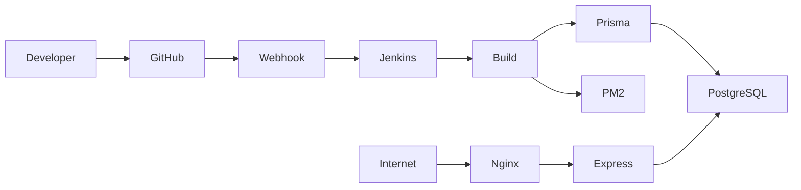
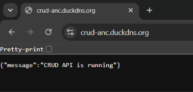
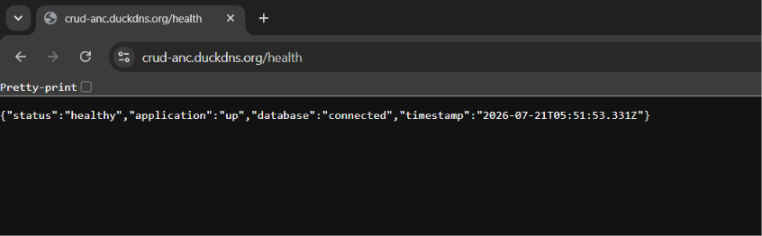

# 🚀 CRUD API Deployment on AWS


---

# 📖 Project Overview

This project demonstrates the deployment of a production-ready CRUD REST API built with **Node.js**, **Express.js**, **Prisma ORM**, and **PostgreSQL** on **AWS EC2**.

The application is deployed using industry-standard DevOps practices including:

- AWS EC2
- AWS RDS PostgreSQL
- Jenkins CI/CD
- GitHub Webhooks
- PM2 Process Management
- Nginx Reverse Proxy
- HTTPS using Let's Encrypt SSL

---

# 🌐 Live Application

### Base URL

```
https://crud-anc.duckdns.org
```

### Health Endpoint

```
https://crud-anc.duckdns.org/health
```

---

# ✅ Features

- Create records
- Read records
- Update records
- Delete records
- PostgreSQL database
- Prisma ORM
- REST API
- Health Check Endpoint
- Automatic Deployment using Jenkins
- GitHub Webhook Integration
- HTTPS Enabled
- Reverse Proxy using Nginx
- PM2 Process Management

---

# 🛠 Tech Stack

| Layer | Technology |
|--------|------------|
| Backend | Node.js |
| Framework | Express.js |
| ORM | Prisma |
| Database | PostgreSQL |
| Cloud | AWS EC2 |
| Database Hosting | AWS RDS |
| Reverse Proxy | Nginx |
| SSL | Let's Encrypt |
| Process Manager | PM2 |
| CI/CD | Jenkins |
| Version Control | Git & GitHub |

---

# 🏗 Architecture



---

# 📁 Project Structure

```
CRUD-API
│
├── prisma
│   ├── schema.prisma
│   └── migrations
│
├── routes
│
├── controllers
│
├── middleware
│
├── docs
│   └── images
│       ├── crud-root.png
│       └── crud-health.png
│
├── app.js
├── package.json
├── Jenkinsfile
└── README.md
```

---

# ☁ AWS Infrastructure

| Resource | Purpose |
|----------|----------|
| EC2 | Application Server |
| RDS PostgreSQL | Database |
| Security Groups | Network Access |
| DuckDNS | Domain |
| Let's Encrypt | SSL Certificate |

---

# ⚙ Deployment Architecture

```
Internet

↓

DuckDNS

↓

HTTPS (443)

↓

Nginx

↓

Express Application

↓

Prisma ORM

↓

AWS RDS PostgreSQL
```

---

# 🚀 CI/CD Pipeline

Deployment is fully automated.

Pipeline Flow:

```
Developer Push

↓

GitHub Repository

↓

GitHub Webhook

↓

Jenkins Pipeline

↓

Install Dependencies

↓

Prisma Migration

↓

Restart PM2

↓

Deployment Successful
```

---

# Jenkins Pipeline Stages

- Checkout Source Code
- Install Dependencies
- Load Environment Variables
- Prisma Migration
- Restart PM2
- Deployment Complete

---

# 🔐 Environment Variables

```
DATABASE_URL=
PORT=
JWT_SECRET=
```

> Environment variables are stored securely on the deployment server and are **not committed** to GitHub.

---

# 🌍 Reverse Proxy

Nginx handles:

- HTTPS
- Reverse Proxy
- SSL Termination
- Request Forwarding

Flow:

```
User

↓

HTTPS

↓

Nginx

↓

Express Server

↓

PostgreSQL
```

---

# 🔒 HTTPS

SSL certificates were generated using:

- Let's Encrypt
- Certbot

Benefits:

- Secure Communication
- Data Encryption
- Trusted Certificate

---

# ⚡ PM2

PM2 is used to:

- Keep application running
- Restart after crashes
- Restart after deployment
- Startup on server reboot

Useful Commands

```
pm2 status

pm2 logs

pm2 restart all
```

---

# 🗄 Database

Database:

- PostgreSQL

Hosted on:

- AWS RDS

ORM:

- Prisma

Migration Command

```
npx prisma migrate deploy
```

---

# 📡 API Endpoints

## Health

```
GET /health
```

---

## Create

```
POST /users
```

---

## Read

```
GET /users
```

---

## Read By ID

```
GET /users/:id
```

---

## Update

```
PUT /users/:id
```

---

## Delete

```
DELETE /users/:id
```

---

# 📷 Deployment Verification

## Home Endpoint



---

## Health Endpoint



Expected Response

```json
{
  "status": "healthy",
  "application": "up",
  "database": "connected"
}
```

---

# 📌 Deployment Steps

1. Launch EC2
2. Install Node.js
3. Install Nginx
4. Configure Reverse Proxy
5. Configure PM2
6. Configure SSL
7. Create Jenkins Pipeline
8. Configure GitHub Webhook
9. Deploy Application

---

# 🎯 Design Decisions

### Why PostgreSQL?

- Reliable
- ACID Compliance
- Production Ready

### Why Prisma?

- Type Safe
- Easy Migrations
- Modern ORM

### Why PM2?

- Process Monitoring
- Automatic Restart

### Why Jenkins?

- Automated Deployment
- Easy Integration
- CI/CD Support

### Why Nginx?

- Reverse Proxy
- SSL Termination
- Better Performance

---

# 🔄 CI/CD Workflow

```
Developer

↓

Git Push

↓

GitHub

↓

Webhook

↓

Jenkins

↓

Install Packages

↓

Database Migration

↓

PM2 Restart

↓

Production Deployment
```

---

# 🧪 Testing

Health Endpoint

```
GET /health
```

Expected Status

```
200 OK
```

---

# 🔮 Future Improvements

- Docker Containerization
- Kubernetes Deployment
- Monitoring with Prometheus
- Grafana Dashboard
- Automated Backup
- GitHub Actions Pipeline
- AWS Load Balancer
- Auto Scaling

---

# 👨‍💻 Author

**Anchit**

DevOps Deployment Project

---

# 🙏 Acknowledgements

- AWS
- Prisma
- PostgreSQL
- Jenkins
- PM2
- Nginx
- Express.js
- Node.js
- Let's Encrypt

---

# 📜 License

This project was developed for educational and DevOps deployment demonstration purposes.


